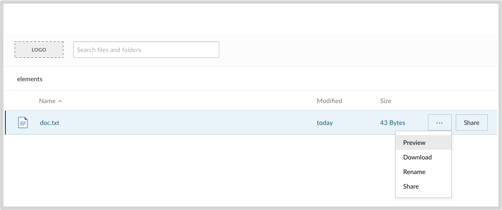

# Box Elements Simple Content Explorer

This is a simple example of a Node + Express server hosting a Box Elements content explorer widget with preview capabilities. This is meant to showcase several concepts:
* How to create a simple microserver example that combines server- and client-side capabilities for production level UI elements.
* Using token downscoping capabilities to tightly scope an access token for front-end JavaScript use.
* Using templating systems (e.g. pug) to host HTML/CSS/JS for the element with dynamically generated values from the server-side component.

## Setup

To set up the needed components of this sample, perform the following: 

1. Create a [new Box JWT application](https://developer.box.com/docs/setting-up-a-jwt-app), download the [JSON config file](https://developer.box.com/docs/setting-up-a-jwt-app#section-use-an-application-config-file), and replace the config.json file in this sample with that version.
1. In the application configuration details, add `http://localhost:3000` to the **CORS** section, or whichever domain / port(s) that you would like to host the sample on (e.g. a Heroku domain). Failing to do this will cause a CORS error in the browser.
1. Open `config.js` and replace the redacted `enterpriseId` variable with your own enterprise ID.
1. Open `server.js` and replace the value of the `folderId` variable with the folder ID that you would like to load in the explorer. This will need to be a folder that is accessible by the service account of your application.
1. Run `npm i` from a terminal window (in the downloaded sample directory) to install all dependencies.

## Running the Sample

To run the sample on localhost:

1. In a command prompt / terminal window run `node server.js` within the root of the sample folder. This will load the Express server on http://localhost:3000.
1. In a browser window, go to http://localhost:3000 to see the sample in action.